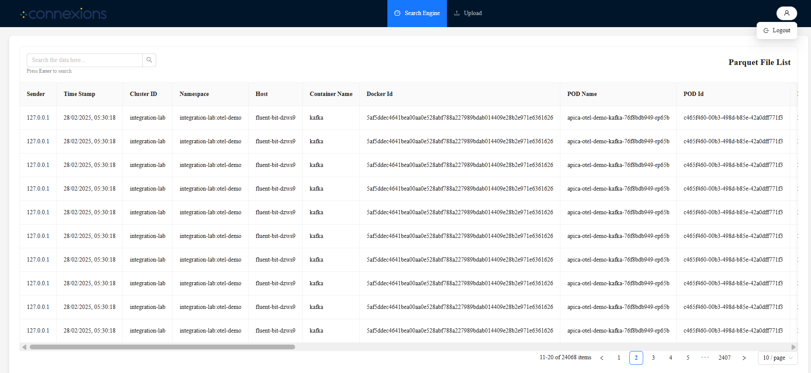
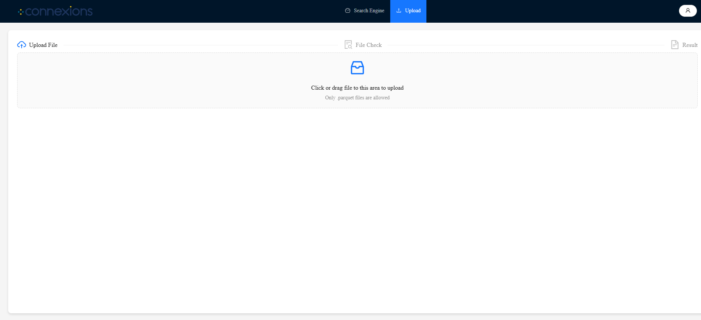

# Search-Engine
Log Search Engine — Full Stack (Golang + React)

🚀 Features
Backend (Golang + Echo)
Loads .parquet files into memory at startup for fast querying

Search API to filter log entries based on parameters

Paginated log retrieval for efficient frontend rendering

Structured JSON parsing for fields like StructuredData and MessageRaw

Upload API to ingest .parquet files dynamically (multipart/form-data)

Clean JSON responses for seamless frontend integration

Frontend (React + TypeScript)
User authentication with private route protection

Parquet file listing and upload interface

Search interface with support for structured fields

Paginated log viewing (pagination handled server-side)

React Query for efficient API handling and caching

Ant Design + Tailwind CSS for sleek UI and responsive design

🧰 Tech Stack
Backend
Golang — Fast and efficient backend language

Echo — Minimalistic HTTP web framework

Parquet-Go — Efficient reading of .parquet files

JSON — Native parsing for nested data structures

Caching - Cached the already present parquet files and giving the result or response on ui

Frontend
React — Component-based UI

TypeScript — Type-safe JavaScript

Tailwind CSS — Utility-first styling

Ant Design — Rich UI component library

React Query — Data fetching, caching, and revalidation

Axios — HTTP client for API communication

⚙️ Getting Started
Backend

cd Backend_Golang  
go mod tidy  
go run cmd/main.go

Frontend

cd Frontend_React  
yarn install  
yarn  dev

🛡 Authentication
Login flow implemented with protected/private routes

Only authenticated users can upload/view .parquet files or access logs

📤 Parquet File Upload
Only .parquet files accepted

Upload handled via multipart form

Files are parsed and indexed in-memory for fast querying

🔍 Log Search & Pagination
Server-side pagination for better performance on large datasets

Supports advanced searching across parsed fields

Nested JSON (StructuredData, MessageRaw) is flattened and searchable

